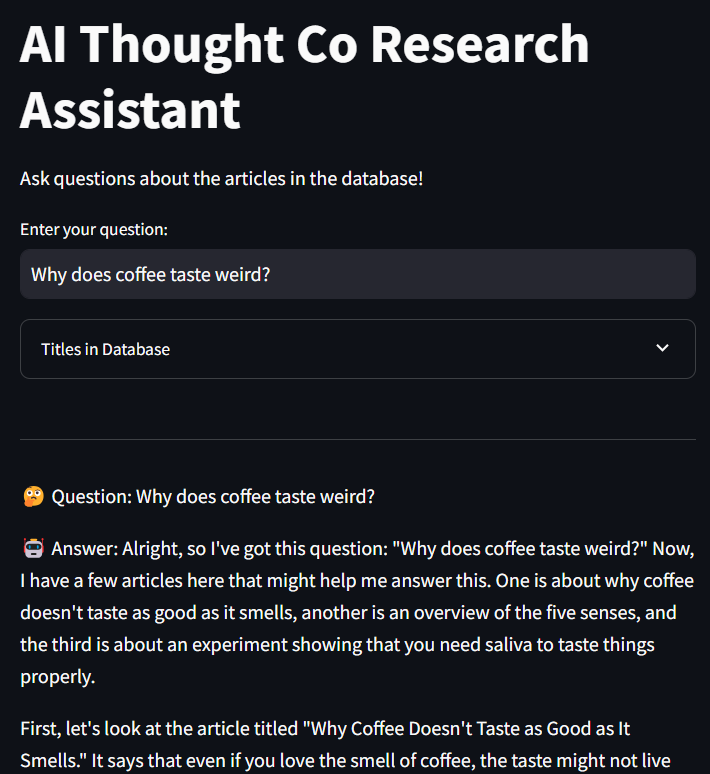

# RAG Chat App

Talk to a chat bot with information from Thought Co. It uses a vector database to access article data as well as a cross encoder to rank relevance to questions. This data is then fed into a chat bot to allow users to talk to and about articles. 

`scraper.py` is used to scrape the Thought Co website for articles and store them in a vector database. 

`use.py` does elementary semantic search on the database to find the most relevant articles to a given question.

`use_cross_encoder.py` uses elementary semantic search as well as a cross encoder to rank the relevance of articles to a given question.

`use_st.py` combines both with groq to allow users to talk to the chat bot. (this didn't work though because of token limits)

`app.py` is the final streamlit app that allows users to talk to the chat bot using the hugging face chat api.

